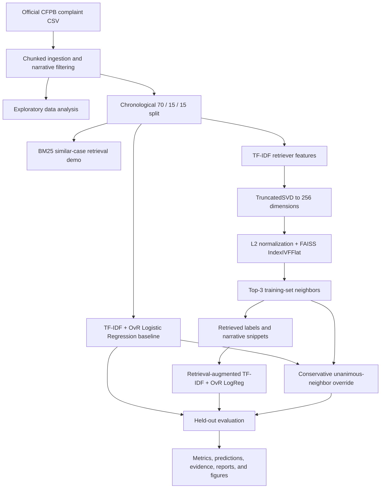

# CFPB Consumer Complaint Retrieval and Issue Classification

[](https://www.python.org/)
[](https://scikit-learn.org/)
[](https://github.com/facebookresearch/faiss)
[](https://www.consumerfinance.gov/data-research/consumer-complaints/)

An end-to-end NLP pipeline for finding similar consumer complaints and
classifying their issue categories at multi-million-document scale.

Built on the full Consumer Financial Protection Bureau (CFPB) complaint dump,
the project combines lexical retrieval, sparse text classification, dimensional
reduction, approximate nearest-neighbor search, and retrieval-augmented
classification in one reproducible workflow.

> **Key result:** on the held-out chronological test set, the TF-IDF + Logistic
> Regression baseline achieved the best weighted F1 (`0.491`). Retrieval-based
> models did not improve classification performance, but they produced
> case-level evidence that can support explanation and human review.

## Contents

- [Why This Project Matters](#why-this-project-matters)
- [Key Highlights](#key-highlights)
- [System Architecture](#system-architecture)
- [Modeling Approaches](#modeling-approaches)
- [Results](#results)
- [Engineering Decisions](#engineering-decisions)
- [Repository Structure](#repository-structure)
- [Quick Start](#quick-start)
- [Configuration](#configuration)
- [Outputs](#outputs)
- [Runtime and Storage](#runtime-and-storage)
- [Limitations and Future Work](#limitations-and-future-work)

## Why This Project Matters

Consumer complaint databases contain valuable evidence about recurring product,
servicing, billing, and fraud-related problems, but the narratives are
unstructured and the label distribution is highly uneven. A useful system must
both assign an incoming complaint to an issue category and surface comparable
historical cases for review.

This repository explores both tasks:

1. **Similar-case retrieval** — rank historical complaint narratives that are
   most relevant to a new complaint.
2. **Issue classification** — predict the CFPB `Issue` label from the consumer's
   narrative.

The pipeline is designed for the full CFPB export: approximately **14.8 million
raw rows**, including about **3.77 million usable consumer narratives** in an
approximately **8.6 GB extracted CSV**.

## Key Highlights

- Processes millions of complaint narratives with chunked CSV ingestion.
- Uses a **chronological 70/15/15 split** to simulate prediction on future
  complaints instead of relying on a random split.
- Implements **BM25** retrieval for transparent lexical similar-case search.
- Establishes a strong **TF-IDF + One-vs-Rest Logistic Regression** baseline.
- Builds a scalable retriever with **TF-IDF → TruncatedSVD(256) → FAISS
  IndexIVFFlat**.
- Tests retrieval-augmented classification by appending the Top-3 historical
  cases and their labels as evidence.
- Adds a conservative hybrid strategy that overrides the baseline only when all
  Top-3 retrieved neighbors agree.
- Includes checkpointing, bounded parallelism, environment-based tuning, and
  Linux/macOS and Windows runners.
- Reports negative results directly: retrieval improved interpretability, not
  held-out classification accuracy.

## System Architecture



The project is an **offline experimental pipeline**. It produces evaluation
artifacts and retrieval evidence; it does not currently expose a serving API or
interactive user interface.

## Modeling Approaches

### 1. BM25 Similar-Case Retrieval

The BM25 demonstration lowercases and tokenizes complaint narratives, builds a
`BM25Okapi` index over the training split, and retrieves the highest-scoring
historical complaints for selected test queries. It provides an interpretable
lexical retrieval baseline and exports both JSON and tabular results.

### 2. TF-IDF + Logistic Regression Baseline

The classification baseline uses:

- lowercase word unigrams and bigrams;
- sublinear term frequency;
- up to 100,000 TF-IDF features;
- `class_weight="balanced"` for label imbalance;
- One-vs-Rest Logistic Regression with the `liblinear` solver.

The model is trained only on the chronological training split and evaluated on
validation and test data using accuracy, Macro-F1, and Weighted-F1.

### 3. Retrieval-Augmented Classification

The RAC pipeline fits a 60,000-feature TF-IDF representation on the training
corpus, compresses it with TruncatedSVD, L2-normalizes the dense embeddings, and
indexes them with FAISS `IndexIVFFlat`. Inner product on normalized vectors is
used as cosine similarity.

For each example, it retrieves the Top-3 training complaints and constructs:

```text
Query narrative: <current complaint>

Retrieved evidence:
Similar case 1. Issue: <label>. Narrative: <snippet>
Similar case 2. Issue: <label>. Narrative: <snippet>
Similar case 3. Issue: <label>. Narrative: <snippet>
```

A second TF-IDF + One-vs-Rest Logistic Regression classifier is then trained on
this augmented text. Self-matches are excluded when creating training examples.

### 4. Conservative Hybrid

The hybrid model starts with the baseline prediction. It replaces that
prediction only when the Top-3 retrieved neighbors unanimously share the same
Issue label. The output records how often this rule overrides the baseline.

## Results

Reference results from the full-data, held-out chronological test split:

| Model | Accuracy | Macro-F1 | Weighted-F1 |
| --- | ---: | ---: | ---: |
| **TF-IDF + Logistic Regression** | **0.479** | **0.174** | **0.491** |
| Retrieval-Augmented Classification | 0.443 | 0.140 | 0.455 |
| Conservative Hybrid | 0.467 | 0.173 | 0.478 |

### Interpretation

The plain TF-IDF baseline was the strongest classifier. Appending retrieved
labels and snippets introduced useful evidence, but it also added noisy signals
and did not improve generalization to later complaints. The conservative hybrid
recovered some of the RAC performance loss, but still remained below the
baseline.

Macro-F1 is substantially lower than Weighted-F1 across all models, which is
consistent with a long-tailed Issue distribution: performance on frequent
classes dominates the weighted score, while rare classes remain difficult.

This result is practically important. Retrieval augmentation should be
validated empirically rather than assumed to improve prediction. In this
project, its clearest benefit is **explainability through similar historical
cases**, not higher classification accuracy.

## Engineering Decisions

### Scalable ingestion

All read-heavy stages use pandas' C CSV engine with `dtype=str`,
`chunksize=200_000`, progress reporting, and a row-count estimate based on the
first 50 MB of the file. Invalid or empty narratives—including the literal
`"nan"` produced by string conversion—are removed consistently.

### Chronological evaluation

Complaints are sorted by `Date received` before splitting. This prevents newer
examples from influencing training and creates a more realistic evaluation than
a random split.

### Approximate retrieval

Brute-force nearest-neighbor search over millions of high-dimensional sparse
vectors is not practical. TruncatedSVD reduces the retrieval representation to
256 dense dimensions, and FAISS IVF search limits the number of inverted lists
examined for each query.

### Memory-aware classification

One-vs-Rest training can create many concurrent Logistic Regression fits. RAC
therefore defaults to 16 workers through `CS410_OVR_N_JOBS` instead of using all
available cores, avoiding excessive memory pressure on large machines.

### Recovery after long-running retrieval

RAC writes `outputs/rac_augmented_df.parquet` immediately after retrieval. If
classifier training fails, rerunning the stage resumes from this checkpoint
instead of rebuilding the index and retrieving millions of neighbor sets.

## Repository Structure

```text
.
├── README.md
├── requirements.txt
├── download_data.sh
├── download_data.ps1
├── run_all.sh
├── run_all.ps1
└── pipeline/
    ├── common.py
    ├── 00_check_header.py
    ├── 01_eda.py
    ├── 02_eda_report.py
    ├── 03_make_subset.py
    ├── 04_make_split.py
    ├── 05_bm25_demo.py
    ├── 06_tfidf_logreg_baseline.py
    ├── 07_retrieval_augmented_classification.py
    ├── 08_hybrid_retrieval_classifier.py
    └── 09_compare_results.py
```

| Stage | Purpose |
| ---: | --- |
| 00 | Verify the source CSV header |
| 01 | Generate EDA summaries and figures |
| 02 | Render a report-ready EDA narrative |
| 03 | Optionally materialize a smaller development subset |
| 04 | Create chronological train, validation, and test IDs |
| 05 | Run the BM25 retrieval demonstration |
| 06 | Train and evaluate the TF-IDF baseline |
| 07 | Build FAISS retrieval evidence and train RAC |
| 08 | Apply the conservative hybrid override |
| 09 | Compare models and generate the final summary |

## Quick Start

### 1. Create the environment

```bash
conda create -y -n cs410 python=3.10 pip
conda activate cs410
pip install -r requirements.txt
```

Core dependencies include pandas, scikit-learn, matplotlib, `rank_bm25`,
`faiss-cpu`, tqdm, PyArrow, and NumPy.

### 2. Download the CFPB data

The downloader fetches the official CFPB archive and extracts
`data/complaints.csv`.

```bash
# Linux or macOS
./download_data.sh

# Windows PowerShell
./download_data.ps1
```

The compressed archive is approximately 1.8 GB and the extracted CSV is
approximately 8.6 GB. To use an existing file, set `CS410_DATA_PATH`.

### 3. Run the pipeline

```bash
# Linux or macOS
./run_all.sh

# Windows PowerShell
./run_all.ps1
```

Run only a range of stages:

```bash
./run_all.sh --from 4 --to 6
```

```powershell
.\run_all.ps1 -From 4 -To 6
```

Stage 03 is skipped by default unless it is selected explicitly.

### Fast local iteration

Use the first 200,000 rows while checking the pipeline on a smaller machine:

```bash
CS410_MAX_ROWS=200000 ./run_all.sh --from 0 --to 6
```

PowerShell:

```powershell
$env:CS410_MAX_ROWS = "200000"
.\run_all.ps1 -From 0 -To 6
```

### Resume RAC after a failure

Stage 07 automatically reloads `outputs/rac_augmented_df.parquet` when the
checkpoint exists. Re-run the stage to resume classifier training:

```bash
./run_all.sh --from 7 --to 7
```

Delete the checkpoint only when a clean retrieval run is required.

## Configuration

No environment variables are required for the default full-data run.

| Variable | Default | Purpose |
| --- | --- | --- |
| `CS410_DATA_PATH` | `data/complaints.csv` | CFPB source CSV |
| `CS410_OUT_DIR` | `outputs` | Tables, reports, predictions, and checkpoints |
| `CS410_FIG_DIR` | `figs` | Generated PNG figures |
| `CS410_SPLIT_NAME` | `split_full.json` | Split filename under the output directory |
| `CS410_SPLIT_PATH` | `<OUT_DIR>/<SPLIT_NAME>` | Full split-path override |
| `CS410_SPLIT_COUNTS_NAME` | `split_counts_full.csv` | Split summary filename |
| `CS410_MAX_ROWS` | unset | Limit CSV reads for faster iteration |
| `CS410_OVR_N_JOBS` | `16` | RAC One-vs-Rest worker count |
| `CS410_SVD_DIM` | `256` | Dense retrieval dimension |
| `CS410_IVF_NLIST` | `1024` | Target number of FAISS IVF lists |
| `CS410_IVF_NPROBE` | `16` | IVF lists probed per query |
| `CS410_IVF_TRAIN_SAMPLES` | `262144` | Samples used to train the IVF quantizer |
| `CS410_BM25_TOPK` | `5` | BM25 result count |
| `CS410_BM25_NUM_QUERIES` | `2` | Number of BM25 demonstration queries |
| `CS410_SRC_PATH` | `data/complaints.csv` | Optional subset source |
| `CS410_SUBSET_PATH` | `data/complaints_subset.csv` | Optional subset destination |
| `CS410_N_LINES` | `200001` | Lines copied into the optional subset |

## Outputs

The pipeline creates:

- **EDA:** `eda_summary.csv`, label-frequency tables, monthly counts, a
  report-ready summary, and four figures.
- **Split:** `split_full.json` and `split_counts_full.csv`.
- **BM25:** `retrieval_demo.json` and `retrieval_demo_table.csv`.
- **Baseline:** metrics, a classification report, and row-level predictions.
- **RAC:** metrics, a classification report, predictions, retrieval evidence,
  and the augmented-text Parquet checkpoint.
- **Hybrid:** metrics and row-level predictions, including the override signal.
- **Comparison:** a three-model comparison table, final summary text, and a
  Weighted-F1 comparison figure.

Key output paths:

```text
outputs/
├── eda_summary.csv
├── split_full.json
├── retrieval_demo.json
├── tfidf_logreg_issue_metrics.csv
├── tfidf_logreg_issue_predictions.csv
├── rac_issue_metrics.csv
├── rac_retrieval_evidence.csv
├── rac_augmented_df.parquet
├── hybrid_retrieval_issue_metrics.csv
├── classification_model_comparison.csv
└── classification_report_ready.txt

figs/
├── top_products.png
├── top_issues.png
├── text_len_words_hist.png
├── month_counts.png
└── classification_model_comparison.png
```

## Runtime and Storage

The full pipeline was developed on a workstation with 96 CPU cores and 1 TB of
RAM.

| Stage | Reference runtime |
| --- | ---: |
| Header check | < 1 second |
| EDA | ~4 minutes |
| EDA report | < 1 second |
| Chronological split | ~2 minutes |
| BM25 demonstration | ~25 minutes |
| TF-IDF baseline | ~73 minutes |
| RAC | ~5 hours 44 minutes |
| Hybrid | ~18 minutes |
| Final comparison | < 2 seconds |
| **Total** | **~7.5 hours** |

Plan for approximately **25 GB of free space**:

- source CSV: ~8.6 GB;
- RAC augmented-text checkpoint: ~5 GB;
- retrieval evidence: ~4.5 GB;
- prediction files: ~1.3 GB per model.

Runtime and memory requirements scale with the number of usable narratives.
`CS410_MAX_ROWS`, `CS410_OVR_N_JOBS`, and the FAISS/SVD settings can be reduced
for development on smaller machines.

## Limitations and Future Work

Current limitations:

- No model serialization or online inference API.
- No automated test suite or continuous-integration workflow.
- BM25 is demonstrated qualitatively rather than evaluated with Recall@K, MRR,
  or nDCG.
- RAC includes retrieved training labels in the augmented text and may overfit
  noisy neighbor evidence.
- Retrieval and hybrid hyperparameters are fixed rather than systematically
  tuned.
- Rare Issue classes remain difficult, as reflected in the low Macro-F1.
- The repository does not currently declare a software license.

Potential next steps:

- Evaluate dense sentence embeddings and learned rerankers.
- Add confidence-aware or similarity-weighted retrieval fusion.
- Tune retrieval depth and decision thresholds on the validation split.
- Report per-class performance and error clusters for long-tail Issues.
- Persist the preprocessing, retrieval, and classification artifacts.
- Add unit tests, smoke tests on a small fixture, and CI.
- Expose a lightweight API for prediction and supporting-case retrieval.

## Data Source

The data is published by the
[Consumer Financial Protection Bureau](https://www.consumerfinance.gov/data-research/consumer-complaints/).
Complaint narratives may contain sensitive or personal information; review the
CFPB's terms and data guidance before redistributing derived artifacts.
